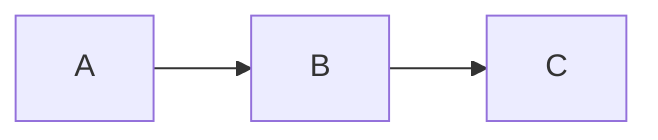
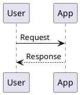

# Mixed Diagrams

## Mermaid Flowchart


```mermaid
graph LR
    A --> B --> C
```

## PlantUML Sequence


```plantuml
@startuml
User -> App: Request
App --> User: Response
@enduml
```

## Regular Code

```python
print("not a diagram")
```

Done.
